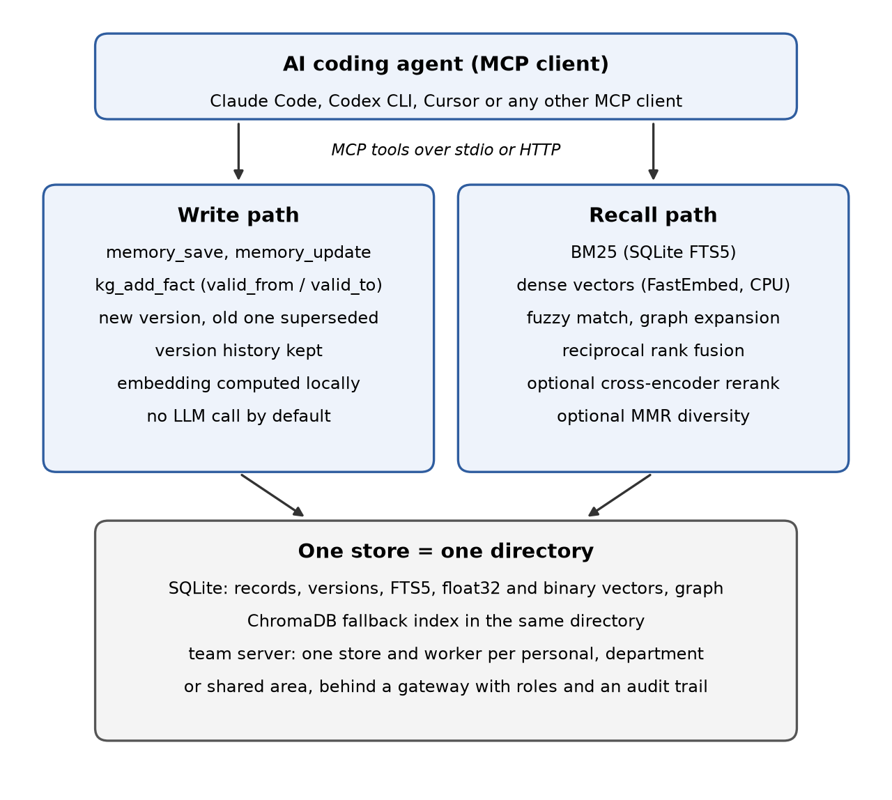

# Summary

AI coding agents such as Claude Code, Codex CLI and Cursor start every session without memory of earlier ones. Decisions, fixes and project conventions from yesterday have to be explained again. `total-agent-memory` (TAM) is an open-source memory server for such agents. It stores decisions, solutions, facts, errors and session summaries on the user's machine and gives them back through the Model Context Protocol (MCP) [@mcp], so any MCP client can use it without code changes.

Each TAM store is one directory built around a SQLite database. Search combines full-text BM25 [@robertson2009bm25], dense embeddings computed locally, fuzzy matching and a knowledge graph, and fuses the ranked lists with reciprocal rank fusion [@cormack2009rrf]. An optional cross-encoder reranks the result and maximal marginal relevance [@carbonell1998mmr] can diversify it. The default profile makes no LLM call on write or search. Facts can carry validity intervals, so the store can answer what was true at a given time, and a newer value of a single-valued fact can retire the older one. Since release 14.6.0 the same code can also run as a team server: personal, department and company areas are separate stores behind one gateway, with roles, authorship and an audit trail.

The package is written in Python, released under the MIT license, and distributed on PyPI as `total-agent-memory`.

# Statement of need

Research on agent memory needs systems that can be run, inspected and measured on public benchmarks such as LoCoMo [@maharana2024locomo], LongMemEval [@wu2024longmemeval], BEAM [@tavakoli2025beam] and MemoryAgentBench [@hu2025memoryagentbench]. Many memory layers that are used in practice are hosted services, or they call an LLM on every write to extract memories [@chhikara2025mem0]. That makes experiments slower and more expensive, it ties results to a provider's model versions, and it makes a run hard to repeat.

TAM is built for this setting. Its default pipeline is deterministic and runs offline, so retrieval quality can be measured without any model in the loop and a rerun gives the same result. Every runner for the public benchmarks disables usage-based score boosts, which would otherwise let a store score better on its own second run. Negative controls (random, earliest and most recent turns) are scored next to the main metric on LoCoMo, so each reported number comes with its floor. When an LLM is used, for example to answer questions in end-to-end evaluations, the model, prompt and seed are recorded and several runs are reported.

The target users are researchers and engineers who study memory for agents, compare retrieval designs, or need a memory baseline that they can run locally and change. The same server is also used in daily work with coding agents, which gives a steady supply of real usage and bug reports.

# State of the field

MemGPT [@packer2023memgpt], now continued as Letta, manages tiers of context for one agent. Mem0 [@chhikara2025mem0] extracts and consolidates facts from conversations with an LLM, with an optional graph variant. Zep [@rasmussen2025zep] builds a temporal knowledge graph of conversations and business data. These systems focus on what to store and how to retrieve it, and they are usually deployed as services with an LLM in the write path.

TAM differs in three ways. First, it is local by default and needs no LLM to write or search, which is what makes deterministic retrieval benchmarks possible. Second, it is MCP-native: the memory is a tool server that any MCP client can call, rather than a library that has to be wired into one agent framework. Third, it treats evaluation as part of the software. The repository ships runners and raw results for LoCoMo, LongMemEval, BEAM and MemoryAgentBench, a head-to-head report that grades TAM's answers and Mem0 Platform's published answers under the same judge, and a benchmark of department isolation on the team server [@cherepanov2026orgmemory].

We do not claim that TAM retrieves better than the systems above in general. The head-to-head report found no statistically detected difference from Mem0 Platform on the held-out questions it covers, and it states that this does not show equivalence.

# Example

An agent uses TAM through ordinary MCP tool calls. In one session the user explains a choice, and the agent saves it as a decision with the reason:

```python
memory_save(type="decision",
            content="Chose pgvector over ChromaDB for the vector store",
            context="WHY: one Postgres instance, row-level security per tenant",
            project="billing")
```

Days later, in a new session and possibly another directory, the user asks why pgvector was chosen. The agent calls:

```python
memory_recall(query="vector database choice", project="billing")
```

and gets the decision back with its reason, the time it was saved and its ID. If the decision changes later, `memory_update` stores a new version and marks the old one as superseded, so the next recall returns the new decision, while `memory_history` still shows the old version and the version that replaced it. On the team server it also shows who made the change and why. For larger result sets the agent can call `memory_recall` in an index mode that returns only IDs and titles, and then fetch the few records it needs with `memory_get`.

The same calls are what the benchmark runners in the repository use, so an experiment exercises the code path that users run.

# Software design

{ width=85% }

\autoref{fig:architecture} shows the main parts. The design follows from three goals: memory must stay on the user's machine, results must be repeatable, and any MCP client must be able to use it.

**One store, one directory.** A store is a directory built around a SQLite database with FTS5 for text search and tables for records, versions and the knowledge graph. Embeddings are computed with FastEmbed on the CPU and stored in SQLite next to the records, both as full float32 vectors and as binary-quantized copies for fast candidate search. A ChromaDB index in the same directory serves as a fallback while the SQLite vector index is not yet populated. Keeping a store in one directory makes it easy to copy, back up and delete, and makes an experiment easy to reset. SQLite also gives transactions for free. On the team server, a change, its new version and its audit row are written in one transaction, so a crash cannot leave a record that was changed without a history entry. The cost is that one SQLite database serves one writer at a time, which is enough for one person and is handled by one worker process per area on the team server.

**No LLM in the default path.** Many memory layers ask an LLM to extract facts from every message. TAM stores what the agent sends and indexes it locally. This keeps writes fast and free, keeps the data on the machine, and makes retrieval deterministic, which is what allows a benchmark run to be repeated exactly. An LLM can be configured for optional stages such as summaries, contradiction checks or query rewriting, and each of them can be switched off.

**Hybrid retrieval with fusion.** A query runs BM25, dense search, fuzzy matching and graph expansion. Their ranked lists are fused with reciprocal rank fusion, which needs no score calibration between retrievers. A cross-encoder rerank and MMR are optional stages. The trade-off is latency: the fused pipeline answers in tens of milliseconds on a warm store, while a cold first query pays for loading the models.

**Facts that change.** Records are versioned instead of overwritten. An update writes a new version and marks the old one as superseded, and a history call returns the whole chain. Knowledge-graph facts carry `valid_from` and `valid_to`, so a query can ask what was true at a point in time. This keeps the store append-only and auditable, at the cost of a larger database.

**MCP as the interface.** The server exposes its operations as MCP tools over stdio or HTTP. A compact index-then-fetch pattern lets an agent first get record IDs and titles and then fetch only the records it needs, which keeps the agent's context small.

**Team server.** For companies, a gateway authenticates personal tokens and runs each personal, department and shared area in its own worker process and store, checking membership on every request. On a synthetic company, attacks across nine attempt types returned no records of other departments, and membership changes applied from the next request [@cherepanov2026orgmemory]. The cost is one process per active area; release 14.6.0 moved the cross-encoder to the gateway so that it runs once per query instead of once per area. A PostgreSQL backend with one schema and database role per area is also available.

**Tests.** The repository has 255 test files. Continuous integration installs and smoke-tests the package on Linux, macOS and Windows, and runs the team-server suite on both SQLite and PostgreSQL.

# Research impact statement

TAM is used as a method in MemoryAgentBench [@hu2025memoryagentbench]: its maintainers merged an adapter that runs TAM under the same configurations as the other memory methods in the benchmark (HUST-AI-HYZ/MemoryAgentBench pull request 25, September 2026). An independent atlas of open-source agent-memory systems described one TAM technique, a second retrieval that looks for contradicting evidence before answering, as worth reusing in other systems. The saved verdicts of the head-to-head report were recomputed by an external reviewer from the published files, and the report was revised after that review; the revision history is in the report.

The repository has received pull requests from outside contributors, and the software has been forked by other developers. The team-server isolation study built on TAM is published as a preprint with its data and harness [@cherepanov2026orgmemory].

# AI usage disclosure

Generative AI tools were used throughout this project. AI coding assistants (Claude Code with Anthropic Claude models, and OpenAI Codex) were used to write and refactor code, write tests and benchmark harnesses, and draft documentation. An AI assistant (Claude Code with Claude Opus 5.5) helped draft this paper and check its statements against the repository. The author designed the system and chose its architecture, reviewed the generated code and text, decided what to measure and report, and is responsible for the accuracy of all submitted material.

# Acknowledgements

I thank the outside contributors who sent pull requests and bug reports, and the reviewer who recomputed the head-to-head verdicts.

# References
